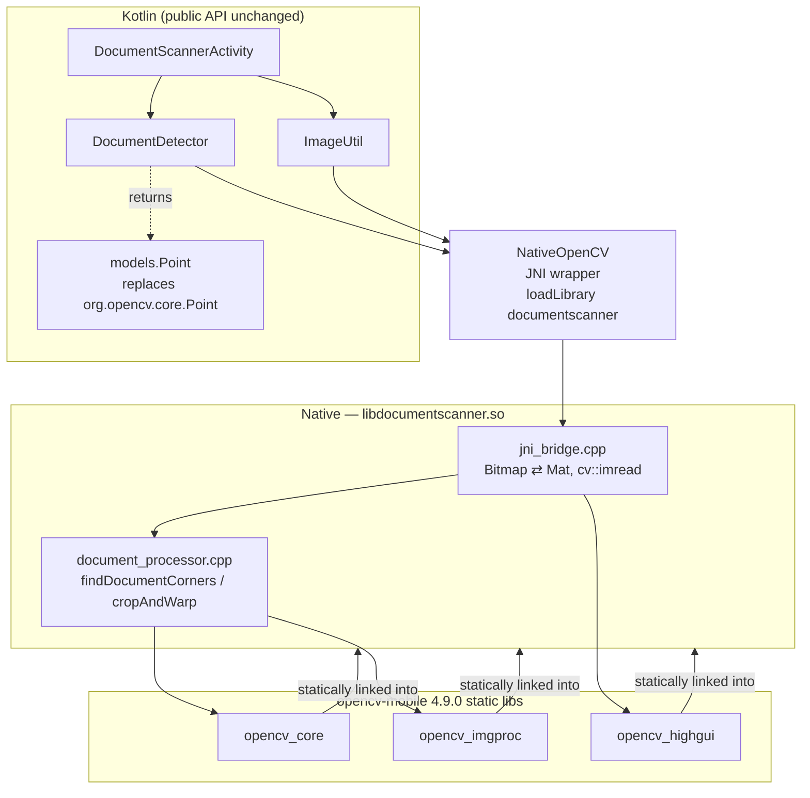

# OpenCV → opencv-mobile Migration

## Goal

Replace the full OpenCV Java SDK dependency (`com.websitebeaver:opencv:4.1.0`, which
bundles a large `libopencv_java4.so` per ABI) with
[nihui/opencv-mobile](https://github.com/nihui/opencv-mobile) to shrink the native
payload that consuming apps ship. The public API of `documentscanner` is unchanged.

**Result:** demo APK ≈ 8 MB (down from tens of MB), with detection/crop behaviour
preserved.

## The core constraint

opencv-mobile ships **C++ only — no Java bindings** (`org.opencv.*` / `opencv_java4`
are dropped; that's how it stays small). The library previously called the OpenCV Java
API directly from Kotlin, so the two pieces of real image processing had to be **ported
to C++** behind a thin JNI layer. Everything else (UI, activity flow, models) stays in
Kotlin.

## Architecture



Only the OpenCV-heavy work crosses into native code; the JNI surface is intentionally
tiny (3 functions taking/returning `Bitmap` + `double[]`). The opencv-mobile `.a`
libraries are **statically linked** into a single small `libdocumentscanner.so`, so only
the OpenCV code that's actually used ends up in the binary.

## JNI surface (`NativeOpenCV`)

| Kotlin `external fun` | Native | Replaces |
|---|---|---|
| `findDocumentCorners(bitmap): DoubleArray` | `document_processor.cpp` | `DocumentDetector` OpenCV logic |
| `crop(bitmap, corners): Bitmap?` | `document_processor.cpp` | `ImageUtil.crop` warp/perspective |
| `readImageFromFile(path): Bitmap?` | `cv::imread` in `jni_bridge.cpp` | `Imgcodecs.imread` |

`jni_bridge.cpp` also provides the `Bitmap ⇄ cv::Mat` conversion that previously came
from `org.opencv.android.Utils`.

## Changes

### New files
- `documentscanner/src/main/cpp/CMakeLists.txt` — downloads the opencv-mobile SDK at
  configure time (gitignored, not committed), requests only `core imgproc highgui`, and
  links them into `libdocumentscanner.so`.
- `documentscanner/src/main/cpp/document_processor.{hpp,cpp}` — 1:1 C++ port of
  `findDocumentCorners` and the crop/warp, using only `core` + `imgproc`.
- `documentscanner/src/main/cpp/jni_bridge.cpp` — JNI entry points, `Bitmap ⇄ Mat`, and
  `cv::imread`.
- `documentscanner/.../NativeOpenCV.kt` — Kotlin JNI wrapper.
- `documentscanner/.../models/Point.kt` — lightweight `Point(x, y)` replacing
  `org.opencv.core.Point` (which was only ever a plain data holder).

### Modified files
- `DocumentDetector.kt` — now delegates to `NativeOpenCV.findDocumentCorners`.
- `utils/ImageUtil.kt` — `getImageFromFilePath` / `crop` delegate to native; keeps the
  `BitmapFactory` + EXIF fallback for images OpenCV can't read.
- `extensions/Point.kt`, `models/Quad.kt` — swap `org.opencv.core.Point` import for the
  new `models.Point`.
- `DocumentScannerActivity.kt` — `System.loadLibrary("documentscanner")` instead of
  `"opencv_java4"`; `Point` import swap.
- `build.gradle` — remove the OpenCV dependency; add `externalNativeBuild` (CMake), NDK
  `abiFilters` (`arm64-v8a`, `armeabi-v7a`, `x86`, `x86_64`), `ndkVersion`, and bump the
  published version to `1.4.0`.
- `consumer-rules.pro` — keep `NativeOpenCV` and native methods so R8 doesn't strip the
  JNI symbols.
- `.gitignore` — ignore the downloaded/extracted SDK and `.cxx`.
- `.github/workflows/deploy-to-maven-central.yml` — install NDK + CMake before building.
- `README.md` — note the opencv-mobile backing and ABI/App-Bundle guidance.

## Version pinning (important)

opencv-mobile is pinned to **4.9.0 (release `v25`)**. This is the release that satisfies
both build constraints of the current toolchain:

- **Links with NDK r25 (clang 14).** Newer releases (e.g. 4.13.0/v35) are built with a
  much newer libc++/libomp (clang 21 / NDK r29) and reference symbols like
  `std::__libcpp_verbose_abort` that older NDKs can't provide → link errors. 4.9.0 is a
  clang-14 build and links on NDK r25 *and* newer NDKs.
- **Supports `minSdk 21`.** 4.9.0 is the first release that lowered OpenCV's minimum
  Android API back to 21 (the older clang-14 build 4.8.1 requires API 24, which conflicts
  with `minSdk 21`).

Override for a newer NDK (e.g. to use the latest OpenCV):

```gradle
externalNativeBuild {
    cmake {
        arguments "-DOPENCV_MOBILE_VERSION=4.13.0", "-DOPENCV_MOBILE_RELEASE=v35"
    }
}
// 4.13.0 / v35 requires NDK r29+
```

## Notes for consumers

- No OpenCV dependency is needed anymore — the native `.so` is bundled in the AAR.
- To minimise APK size, prefer an **Android App Bundle** or **ABI splits** so each device
  downloads only one ABI.
